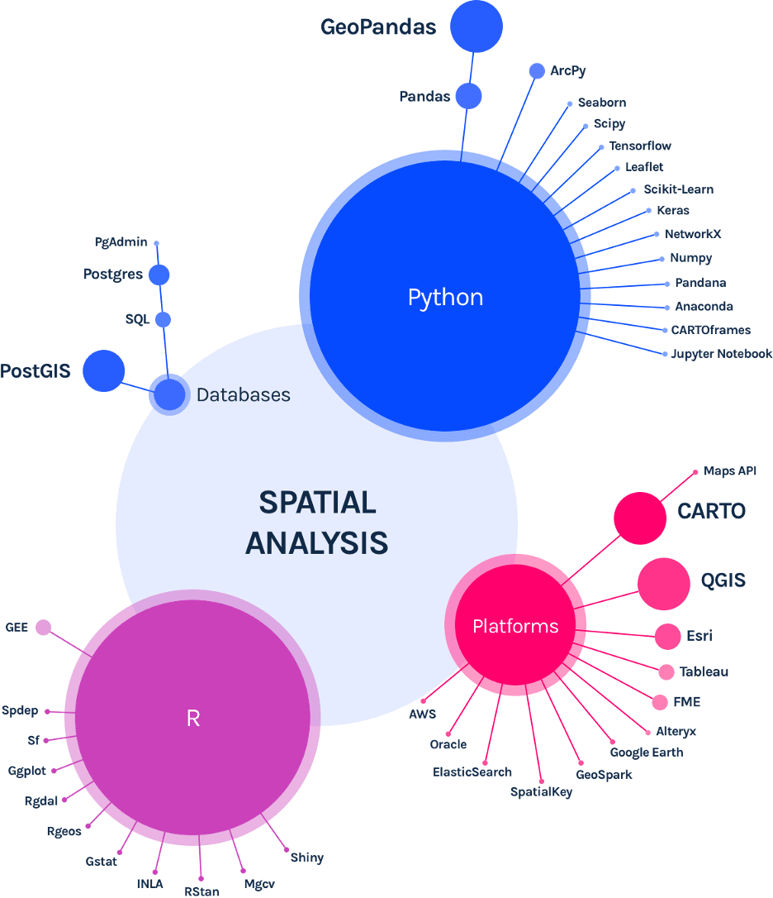

# Leveraging Python for Spatial Data Science

  

workshop on Leveraging Python for Spatial Data Science @ CARTO Spatial Data Science Bootcamp 2023, Washington D.C

    Source:
<a href="https://carto.com/what-is-spatial-data-science#:~:text=What%20skills%20%26%20technologies%20are%20used%20in%20Spatial%20Data%20Science%3F"> Carto <a/>

### Instructor

* [Dr. Taylor Oshan](https://geog.umd.edu/facultyprofile/oshan/taylor) - [center for geospatial information science](https://geospatial.umd.edu/) @ umd 

---

## Schedule
- 

---

### Follow along on Google Colab or binder (recommended)
#### Colab 

#### Binder 

### Follow along on your own machine

Might take some time setting up. 

- make sure you have anaconda installed
    - we recommend the [miniforge distribution](https://github.com/conda-forge/miniforge)
- ` git clone https://github.com/GEOSMASH/carto-sdsc-bootcamp-2023-DC`
- `cd carto-sdsc-bootcamp-2023-DC`
- if you dont have mamba, run `conda install mamba -y`
- `make environment` or `mamba env create -n sdsc23`
- `conda activate sdsc23`
- `jupyter lab`

